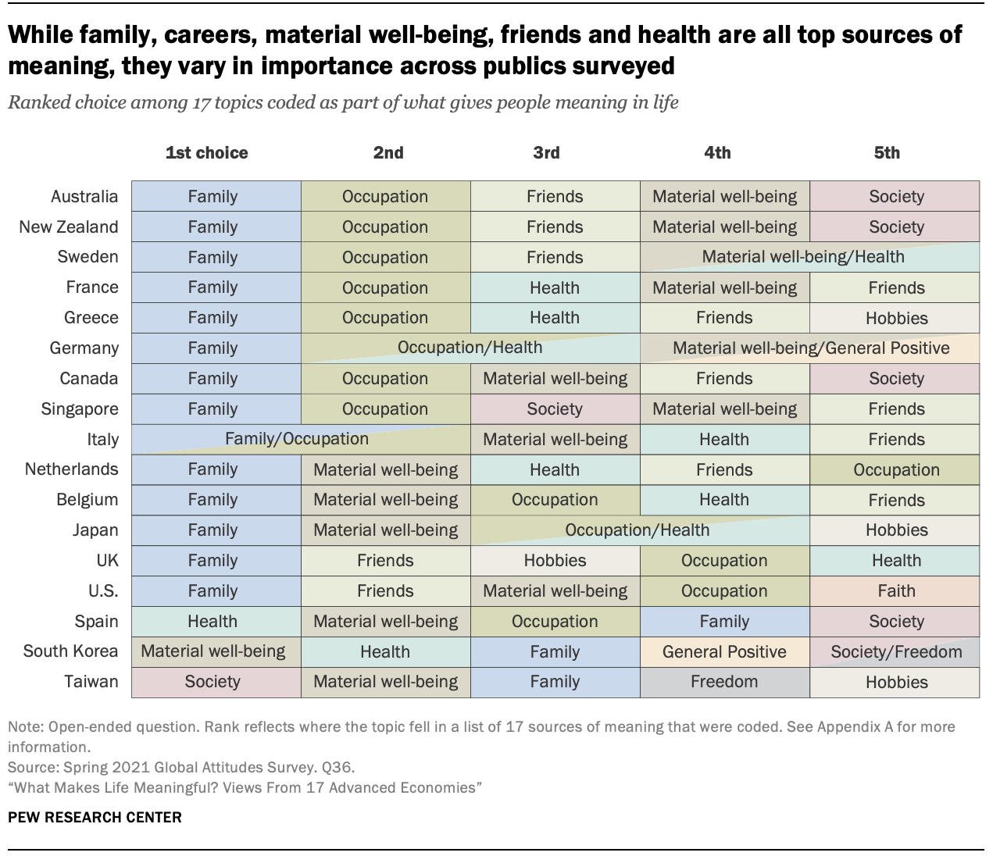

Homework 06
================

For any exercise where you’re writing code, insert a code chunk and make
sure to label the chunk. Use a short and informative label. For any
exercise where you’re creating a plot, make sure to label all axes,
legends, etc. and give it an informative title. For any exercise where
you’re including a description and/or interpretation, use full
sentences. Make a commit at least after finishing each exercise, or
better yet, more frequently. Push your work regularly to GitHub. Once
you’re done, inspect your GitHub repo to make sure it has all the
components you want to submit in the `homework-06.md` file, including
the prose, the code, and all plots.

------------------------------------------------------------------------

Use the following prompt for Questions 1-4.

**Meaning of life.** A 2021 Pew Research survey of 18,850 adults from 17
advanced economies (Canada, Belgium, France, Germany, Greece, Italy, the
Netherlands, Spain, Sweden, the United Kingdom, the United States,
Australia, Japan, New Zealand, Singapore, South Korea and Taiwan) asked
the following question: “We’re interested in exploring what it means to
live a satisfying life. What aspects of your life do you currently find
meaningful, fulfilling or satisfying?” The results of the survey are
summarized in the following visualization, which can be found on [Pew’s
summary of their
findings](https://www.pewresearch.org/global/2021/11/18/what-makes-life-meaningful-views-from-17-advanced-economies/).

1.  **The data.** Create a dataset based on the data presented in this
    visualization. You will want to take a peek at the next question,
    since the dataset you create / how the data are organized will
    depend on the type of visualization you might make in the next
    question.

-   The code to create the data should go in the `data/data-create.R`
    file.
-   The dataset should be called `life_meaning` and saved as
    `life_meaning.csv` in the data folder.

2.  **The visualization.** Create an alternative visualization of these
    data. Accompany your visualization with a brief explanation of how
    you decided to create what you created, as well as how it is similar
    to and how it differs from the original visualization. It’s ok if
    your visulization is such that all the conclusions that can be drawn
    from the original visualization can’t be drawn from yours (e.g.,
    maybe fewer choices per country are displayed), but this should be
    something you articulate in your answer along with a justification
    with why you think it’s ok to omit this feature. Make sure that your
    visualization employs accessibility best practices we’ve discussed
    in class, and write a sentence about features you’ve decided to
    include/omit to meet these guidelines.

-   The code to make the visualization should go in your R Markdown file
    (as usual).

3.  **The app.** Create a Shiny app that features the visualization you
    made and at least one reactive element. The reactivity can be as
    simple as selecting a country to highlight. Deploy the app to
    shinyapps.io.

-   The code of the app should go in the `app1` folder.
-   The link to the deployed app should be included in your R Markdown
    folder.
-   If you have a dataset you’ve created and placed in the `data` folder
    in the root of your project/repo, move that data file into the
    `app1/data` folder. You need everything needed to run the app in the
    `app1` folder for deployment. This creates multiple copies of the
    data in your repo, but that’s ok. If you don’t have a dataset
-   Note: You’ve learned about Shiny in class, but we haven’t covered
    deployment, so completing this question will require a bit of
    self-learning. See [this article on
    deployment](https://shiny.rstudio.com/articles/shinyapps.html) for
    instructions) for instructions for deployment to shinyapps.io, and
    ask questions if you need further guidance!

4.  **The styled app.** Change the look of your app using the theming
    features and the auto-theming option offered by the
    [thematic](https://rstudio.github.io/thematic) package. This will
    allow the look of your app to match the look of your visualization.
    Deploy the app to Shinyapps.io.

-   The code of the app should go in the `app2` folder.
-   The link to the deployed app should be included in your R Markdown
    folder.
-   Note: You’ve learned about Shiny in class, but we haven’t covered
    the thematic package and auto theming. See [this article on auto
    theming](https://rstudio.github.io/thematic/articles/auto.html) for
    instructions on how to use auto theming in a Shiny app, and ask
    questions if you need further guidance!

------------------------------------------------------------------------

We’re going to change gears, to visualizing uncertainty, for the final
question on this assignment.

5.  **The visual uncertainty experience.** Watch the video titled [The
    visual uncertainty experience](https://youtu.be/pTVAn4oLvbc) by
    Jessica Hullman and write a one paragraph summary of what you
    learned.
